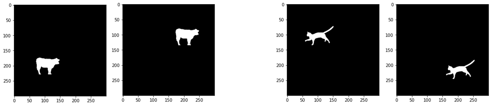
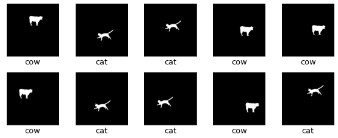

# Code for IU Deep Learning (DLDMSDL01) presentation on topic: Generalization Ability of Deep Learning Models

In this repository you can find the complete code to replicate the examples in my presentation for the course DLDMSDL01 at International University. The example is motivated by the toy example taken from

Geirhos, R., Jacobsen, J.-H., Michaelis, C., Zemel, R., Brendel, W., Bethge, M., & Wichmann, F. A. (2020). Shortcut Learning in Deep Neural Networks. ArXiv:2004.07780 [Cs, q-Bio]. http://arxiv.org/abs/2004.07780

(https://github.com/rgeirhos/shortcut-perspective)

## Installation of virtual environment

All used package dependencies are bundled in the file requirements.txt. In order to use the environment do:

```{bash}
python -m venv .venv
.venv\Scripts\activate.bat # on windows machines
source .venv/bin/activate # on other operating systems
pip install -r requirements.txt
```

## Motivational example:

**Biased training data and i.i.d. test data**
Cats are either shown in top left or bottom right quadrant of image and cows are either shown in top right or bottom left quadrant of image.



**Unbiased o.o.d. test data**
Cats and cows can be shown at random positions on the image.



Different Neural Network architectures were trained on an easy image classification task, determining if either a cat or a cow is shown on a 300 x 300 pixel grayscale image. When trained on biased training data, where the cat is either shown in a random position in the top left or bottom right quadrant of the image and the cow is either shown in a random position in the top right or bottom left quadrant of the image, all architectures failed to perform significantly better than random guessing on out of distribution (o.o.d.) test data where the cat or the cow can appear on any position of the image. All models performed perfectly when tested on independent identically distributed (i.i.d.) test data generated by a random train (0.75) / test (0.25) split from 4000 biased samples.

If data augmentation is implemented accuracy scores up to 79 % were achieved on o.o.d. test data.

The tested deep neural network architectures were:
* standard deep neural network with four fully-connected hidden layers with [512, 256, 128, 64] units
* one block VGG convolutional neural network with a 3 x 3 convolutional layer with 32 filters followed by a 2 x 2 maxpooling layer
* two block VGG convolutional neural network with one additional block with a 3 x 3 convolutional layer with 64 filters followed by a 2 x 2 maxpooling layer
* three block VGG convolutional neural network with one additional block with a 3 x 3 convolutional layer with 128 filters followed by a 2 x 2 maxpooling layer

All models were trained with and without additional dropout.

VGG block architecture for convolutional neural networks were introduced by the Visual Geometry Group (VGG) at Oxford University:
Simonyan, K., & Zisserman, A. (2014). Very deep convolutional networks for large-scale image recognition. arXiv preprint arXiv:1409.1556. https://arxiv.org/abs/1409.1556